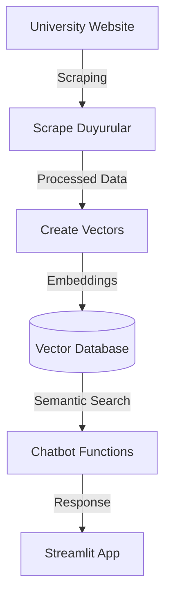

# YU_RAG

University of Yasar GDG on Campus RAG GENERATIVE AI

## Proje Hakkında

YU_RAG, Yaşar Üniversitesi öğrencileri için duyuruları ve diğer akademik bilgileri sunan bir chatbot uygulamasıdır. Bu proje, Generative AI ve Retrieval-Augmented Generation (RAG) tekniklerini kullanarak öğrencilere en güncel ve doğru bilgileri sağlamayı amaçlamaktadır.

## Özellikler

- **Duyuru Çekme ve İşleme:** Üniversite web sitesinden duyuruları otomatik olarak çeker ve işler.
- **Chatbot:** Öğrencilerin sorularını yanıtlayan ve onlara yardımcı olan bir chatbot.
- **Embeddings ve Benzerlik Arama:** Sorgulara en uygun yanıtları bulmak için metin embeddings ve benzerlik arama kullanır.
- **Streamlit Arayüzü:** Kullanıcı dostu bir web arayüzü ile etkileşim sağlar.

## Kurulum

Projeyi yerel ortamınızda çalıştırmak için aşağıdaki adımları izleyin:

1. **Depoyu Klonlayın:**
    ```sh
    git clone https://github.com/kullanici_adi/YU_RAG.git
    cd YU_RAG
    ```

2. **Gerekli Paketleri Yükleyin:**
    ```sh
    pip install -r requirements.txt
    ```

3. **API Anahtarlarını Ayarlayın:**
    `.env` dosyasını oluşturun ve gerekli API anahtarlarını ekleyin:
    ```env
    GEMINI_API_KEY="your_gemini_api_key"
    OPENAI_API_KEY="your_openai_api_key"
    ```

NOTE : GEMINI_API_KEY'i yazmak yeterli olacaktır.

4. **Uygulamayı Başlatın:**
    `YU_app.py` dosyasını çalıştırarak Streamlit uygulamasını başlatın:
    ```sh
    streamlit run YU_app.py
    ```

## Kullanım

- **Ana Sayfa:** Chatbot ile etkileşime geçebilir ve sorularınızı sorabilirsiniz.
- **Duyurular:** Üniversite duyurularını görüntüleyebilir ve detaylarına ulaşabilirsiniz.
- **RAG Mimarisi:** RAG mimarisi hakkında bilgi alabilir ve örnek uygulamaları inceleyebilirsiniz.

## Katkıda Bulunma

Katkıda bulunmak isterseniz, lütfen bir pull request gönderin veya bir issue açın. Her türlü katkı ve geri bildirim memnuniyetle karşılanır.

## Lisans

Bu proje MIT Lisansı ile lisanslanmıştır. Daha fazla bilgi için `LICENSE` dosyasına bakabilirsiniz.


📘 YU_RAG

University of Yasar GDG on Campus – Retrieval-Augmented Generation (RAG) AI Chatbot

📌 Project Overview

YU_RAG is a chatbot application designed for Yaşar University students to provide access to announcements and other academic information.
The project leverages Generative AI and Retrieval-Augmented Generation (RAG) techniques to ensure students receive up-to-date and accurate responses.


## 📊 RAG Pipeline

The architecture of the project is illustrated below:




✨ Features

Announcement Scraping & Processing: Automatically scrapes announcements from the university website and processes them.

Chatbot Interface: Answers students’ questions with the help of a RAG-based chatbot.

Embeddings & Semantic Search: Retrieves the most relevant answers using text embeddings and similarity search.

Streamlit UI: Provides a user-friendly web interface for easy interaction.

🛠️ Project Structure
YU_RAG/
│── data/                     → Data files
│── images/                   → Screenshots & diagrams for documentation
│── env/                      → Environment files (.env goes here)
│── src/                      → Source code
│   │── app.py                → Streamlit main app (formerly YU_app.py)
│   │── functions.py          → Helper functions (formerly YU_functions.py)
│   │── create_vectors.py     → Embedding & vector DB creation
│   │── scrape_duyurular.py   → Web scraping for announcements
│   │── openai_toollog.py     → OpenAI logging utility
│── requirements.txt          → Dependencies
│── README.md                 → Project documentation
│── LICENSE                   → License file


🚀 Installation

Follow the steps below to run the project locally:

Clone the repository

git clone https://github.com/<your_username>/YU_RAG.git
cd YU_RAG


Install dependencies

pip install -r requirements.txt


Set API Keys
Create a .env file inside the env/ folder and add your API keys:

GEMINI_API_KEY="your_gemini_api_key"
OPENAI_API_KEY="your_openai_api_key"


💡 Note: Providing only GEMINI_API_KEY is sufficient.

Run the application

streamlit run src/app.py

📖 Usage

Home Page: Interact with the chatbot and ask questions.

Announcements: View university announcements with detailed information.

RAG Architecture: Learn more about how the RAG model works.

🤝 Contributing

Contributions are welcome!
Please fork the repository and submit a pull request, or open an issue if you encounter a problem.

